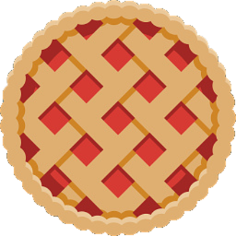
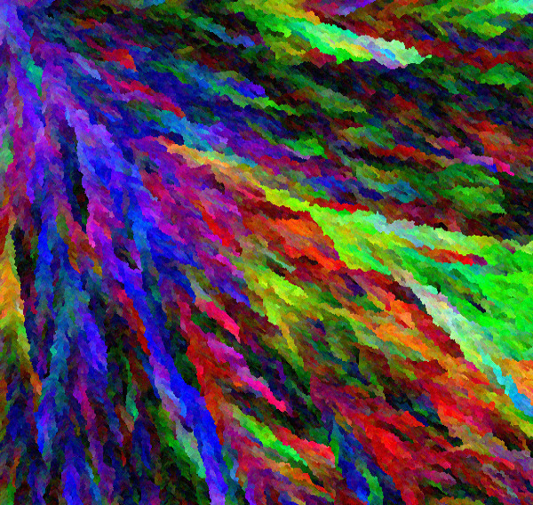
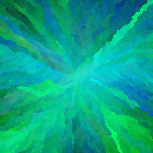
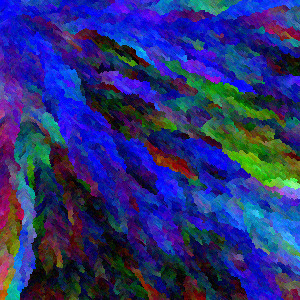
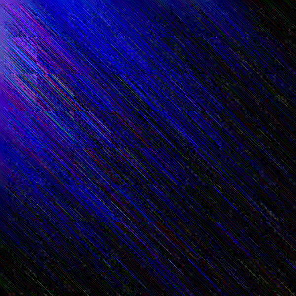
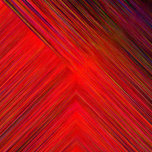
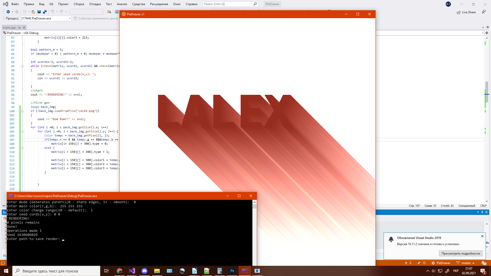

#  PieDrawer
Simple program that can draw different difficult patterns on c++ and sfml.

# There are 3 options:

mode - change main pattern (use 2+ for painting effect)

color range - change color of brushes (20+ to make rainbow effect)

seed cords - just enter cordinates where you want to start

You can also change resolution in cpp file (size1,size2)

# Examples

